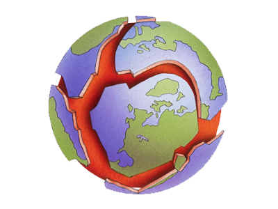

<h1 align="center">
    
</h1>

# ClimateNow!! Promoting Change to Save Planet Earth

ClimateNow!! exposes the terrible truths of climate change and helps concerned citizens of the world come together to create political change. ClimateNow!! is a full-stack web application built on Node.js, Express.js, Handlebars.js, and MySQL.

Running the app:
> DEBUG=* src/app.js

## Packages
- [climate-data-crawler](https://www.npmjs.com/package/climate-data-crawler)
- [sequelize](https://www.npmjs.com/package/sequelize)
- [mysql](https://www.npmjs.com/package/mysql)
- [express-handlebars](https://www.npmjs.com/package/express-handlebars)
- [express](https://www.npmjs.com/package/express)
- [commander](https://www.npmjs.com/package/commander)
- [debug](https://www.npmjs.com/package/debug)

## License

To the extent possible under law, [Sam Saresende](https://github.com/saresende) has waived all copyright and related or neighboring rights to this work.
